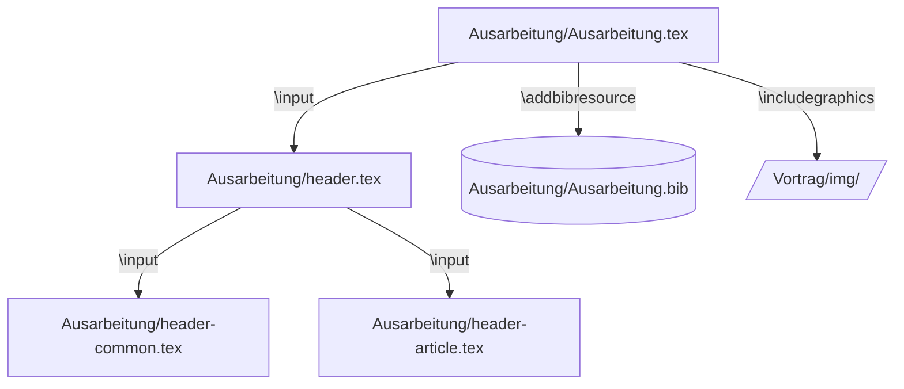
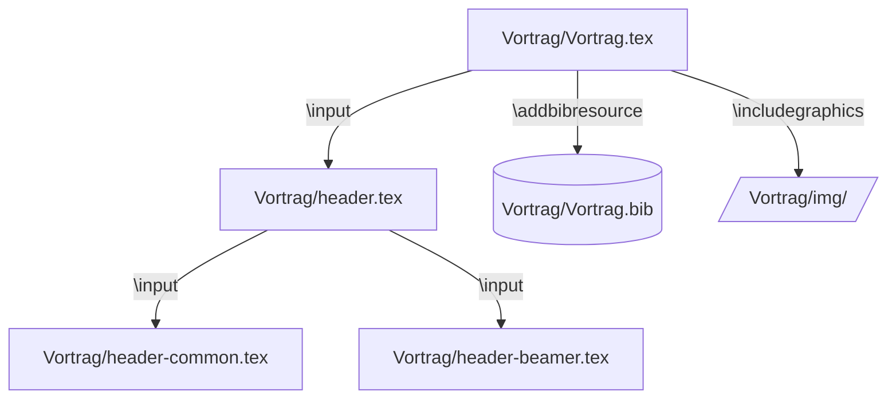
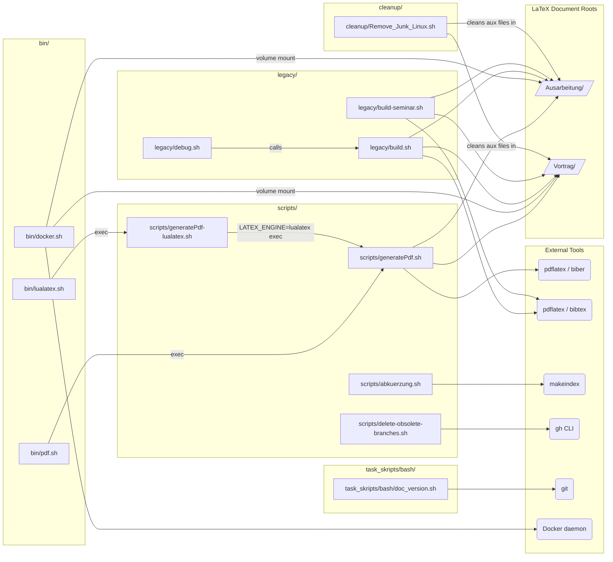
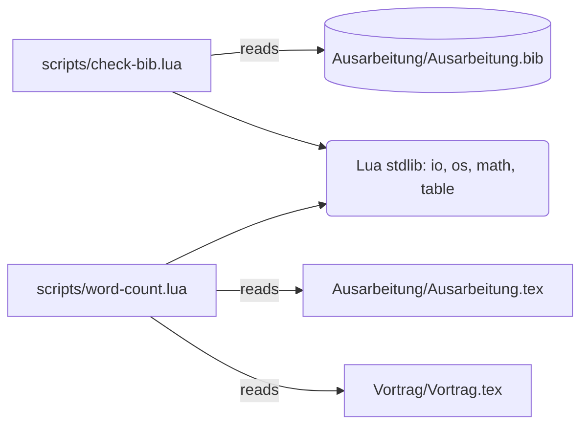
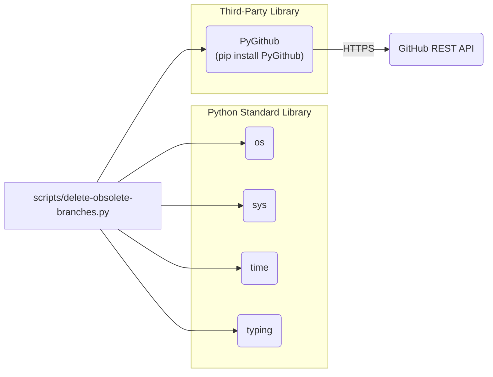
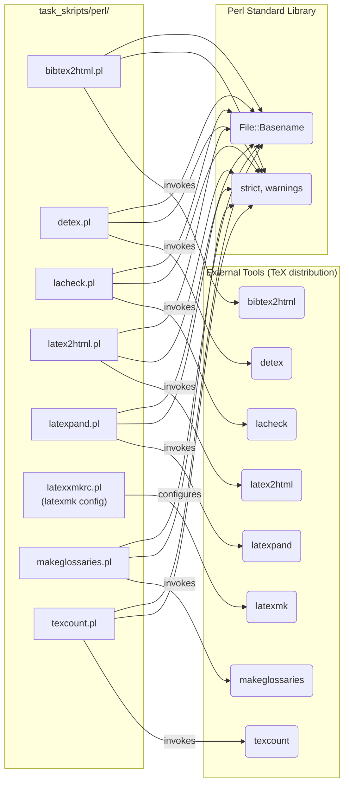
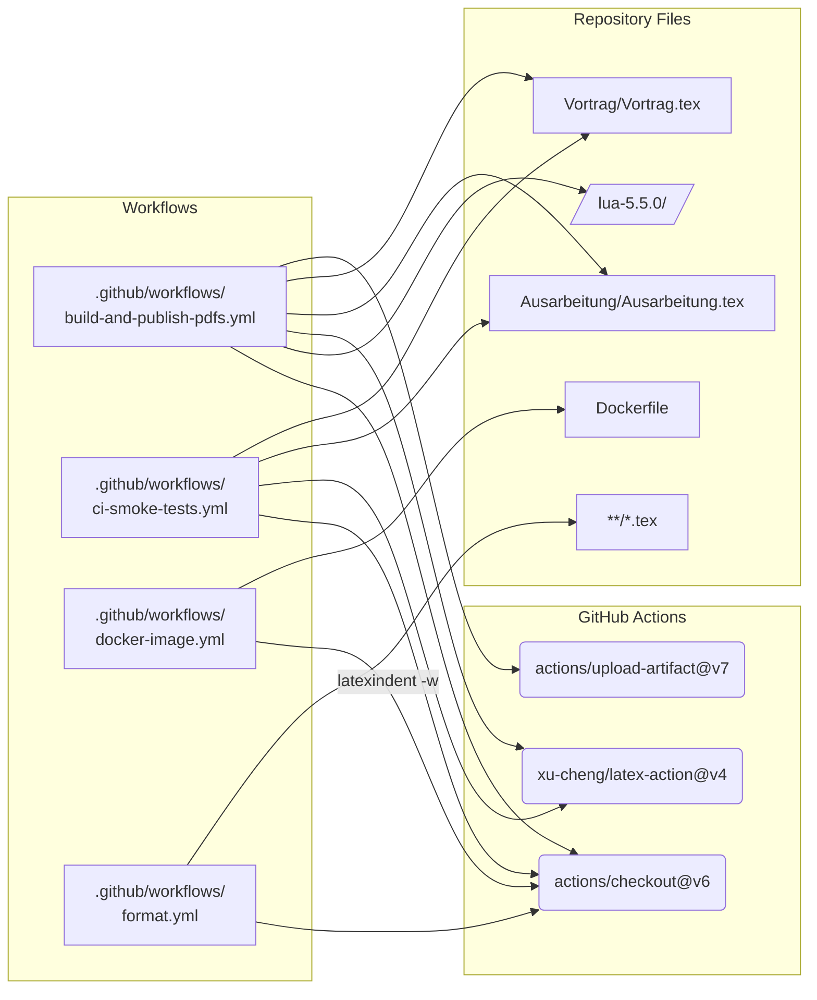
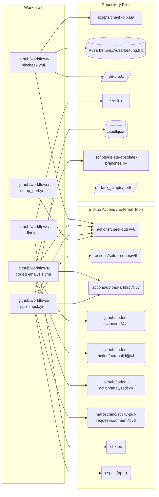
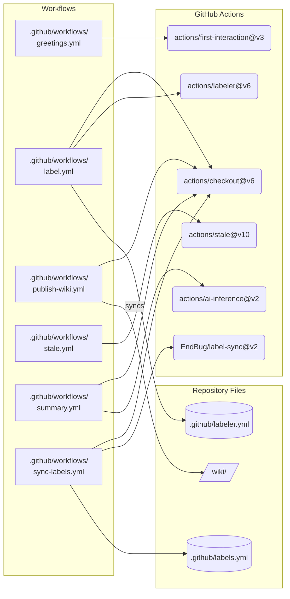

# Dependency Graphs

Complete dependency graphs for all code files in the project, organized by
file type and subsystem. The graphs use **Mermaid** notation, which renders
natively in GitHub Markdown.

**Node shape key**

| Shape | Meaning |
|-------|---------|
| Rectangle `[ ]` | Project source file |
| Rounded rectangle `( )` | External tool / GitHub Action |
| Cylinder `[( )]` | Data file (`.bib`, config) |
| Folder `[/ /]` | Directory |

---

## 1. LaTeX Documents

Dependency trees based on `\input`, `\addbibresource`, and `\includegraphics`.

### 1a. Ausarbeitung (Written Report)

### 1b. Vortrag (Presentation)

---

## 2. Shell Scripts

Call graph: which script delegates to or invokes which other script/tool.

---

## 3. Lua Scripts

File inputs each Lua script reads at runtime.

---

## 4. Python Scripts

Module import dependencies for the Python scripts.

---

## 5. Perl Scripts

Each script in `task_skripts/perl/` is a thin wrapper that invokes an
external TeX-distribution tool. Shared Perl module imports are shown once
in the shared node.

---

## 6. GitHub Actions Workflows

Dependencies between each workflow and the repository files, scripts, and
external actions it uses. Workflows are split into three groups for clarity.

### 6a. Build & Compilation Workflows

### 6b. Code Quality Workflows

### 6c. Repository Management Workflows

